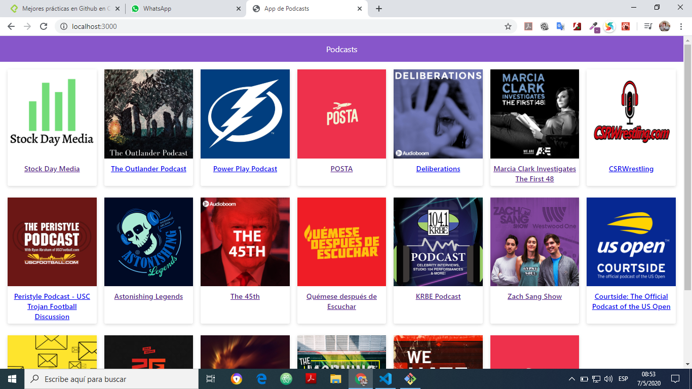

# App de Podcasts

App de Podcasts integrada con la API de AudioBoom

## Funcionamiento

Requiere Node.JS

*`npm install` para instalat las dependecias.
*`npm run dev` para el entorno de desarrollo.
*`npm run build && npm start` para el entorno de produccion.

## Licencia

MIT